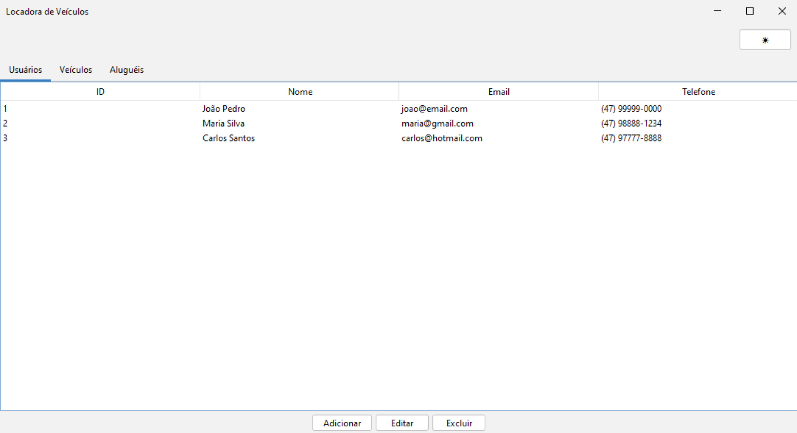
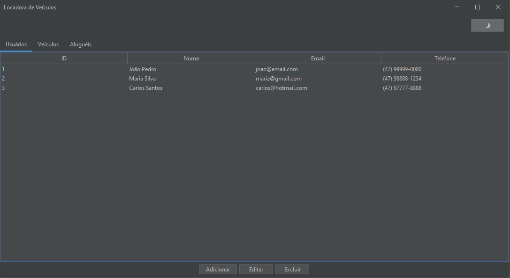
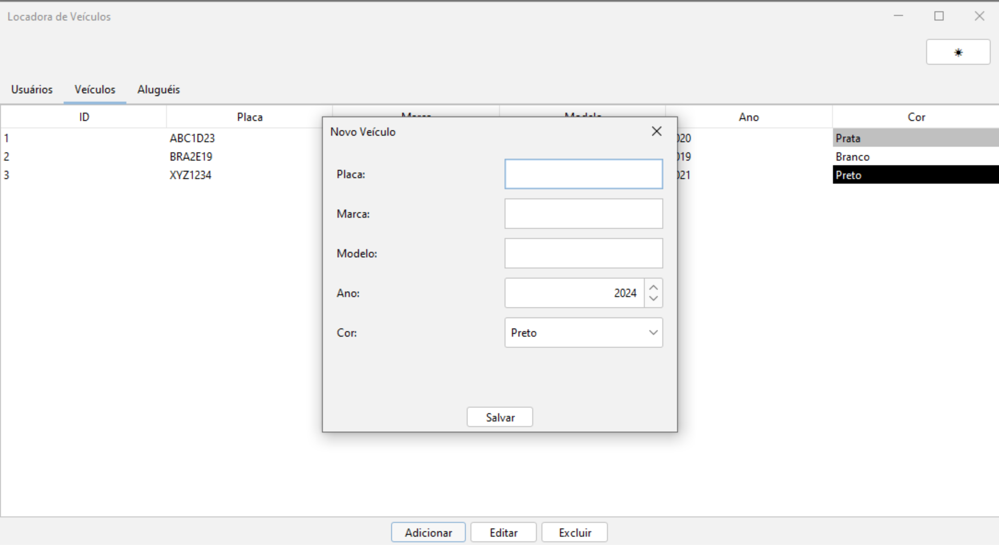
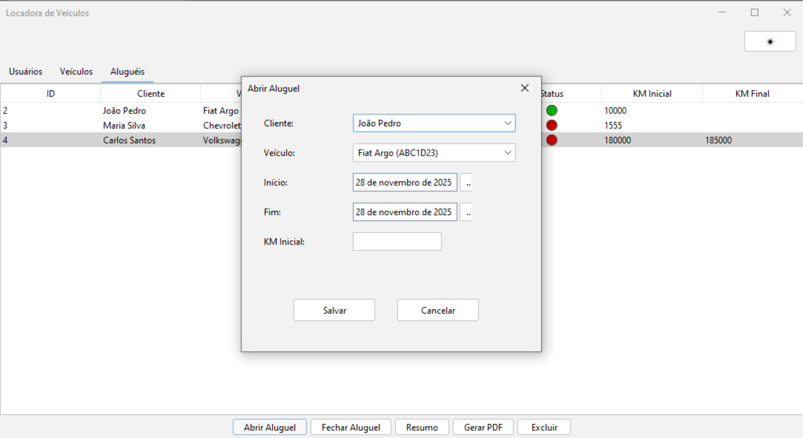
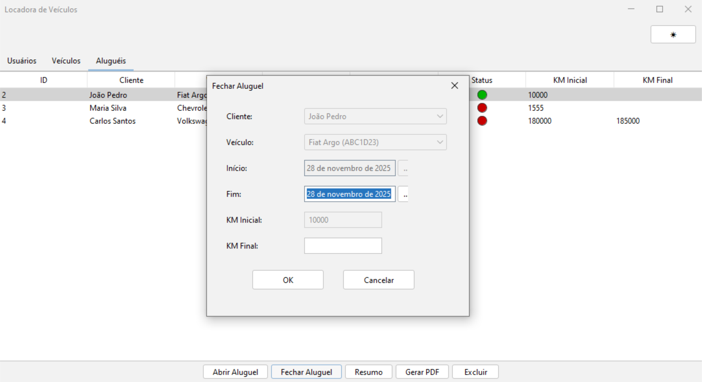
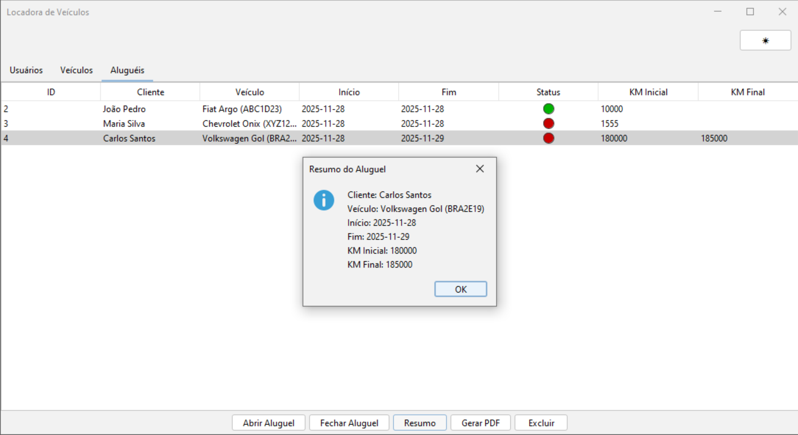

# 🚗 Sistema de Locadora de Veículos  

Um sistema completo de locação desenvolvido em Java (Swing + Hibernate + FlatLaf), permitindo o gerenciamento de usuários, veículos e aluguéis.

---

## 📸 Capturas de Tela 


### Tela Principal — Tema Claro


### Tela Principal — Tema Escuro


### Cadastro de Usuário


### Cadastro de Veículo


### Abertura de Aluguel


### Fechamento de Aluguel


### Resumo do Aluguel



---

## 🔧 Como Executar

### 1. Clone

```
git clone https://github.com/SEU_USUARIO/SEU_REPO.git
```

### 2. Compile

```
mvn clean install
```

### 3. Execute

```
mvn exec:java -Dexec.mainClass="com.locadora.main.PontoDeEntrada"
```

---

## 🤖 Uso de Inteligência Artificial

Este projeto utilizou o modelo **OpenAI GPT-5.1** para:
- Sugestões de design  
- Refatoração de código  
- Validações (regex, regras de negócio)  
- Melhorias de UX  

---

## 📜 Licença

Licença MIT.

